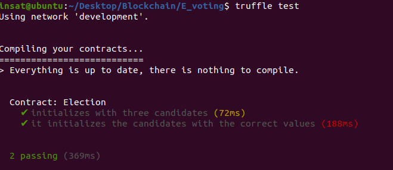
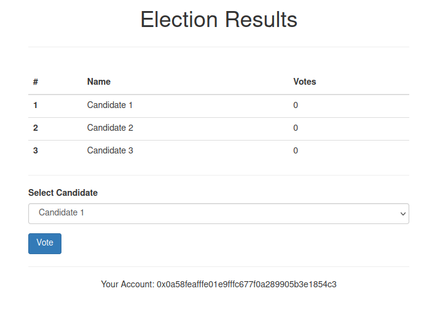

# E-Voting application
- This is a decentralized e-voting app that lets voters choose a candidate from a list one time only using Euthereum.
- We based the app on the pet-shop project unboxed by the Truffle framework.
- We used Ganache as our personal Euthereum blockchain environment for testing.

- We deployed 2 smart contracts written in solidity:
    - Migration : Migrates the app on the blockchain.
    - Election : Holds the candidates and a public vote function for voters.

- We designed 2 tests to verify the deployment of Election.

## Voting process
- In this scenario, we have 3 candidates and 6 voters.

- The index page shows the list of candidates and give the choice for the voter if he didn't vote yet.

- To cast a vote, the voter needs to confirm his transaction in metamask and pays for the gas fees.

- The voting is handled by election.js which uses web3.js library to communicate with the blockchain.
- Finally, we get the current result of the vote.

## Block Analysis
- When we get back to Ganache, we find that each voter has made a transaction.

- The Blockchain contains 14 blocks:
    - Block 0: The first created block
    - Block 1-4: Result of smart-contracts migration
    - Block 2-8: Result of testing
    - Block 9-14: Each block is the vote transaction of a voter.
