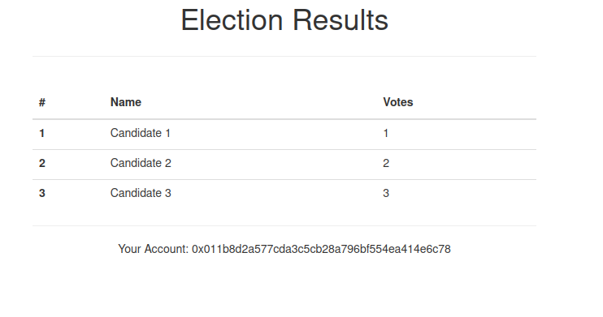

# E-Voting application

- This is a decentralized e-voting app that lets voters choose a candidate from a list one time only using Euthereum.
- We based the app on the pet-shop project unboxed by the Truffle framework.
- We used Ganache as our personal Euthereum blockchain environment for testing.

- We deployed 2 smart contracts written in solidity:
    - Migration : Migrates the app on the blockchain
    - Election : Holds the candidates and a public vote function for voters.

- We designed 2 tests to verify the deployment of Election.

- The index page shows the list of candidates and give the choice for the voter if he didn't vote yet.

- The voting is handled by election.js which uses web3.js library to communicate with the blockchain.

